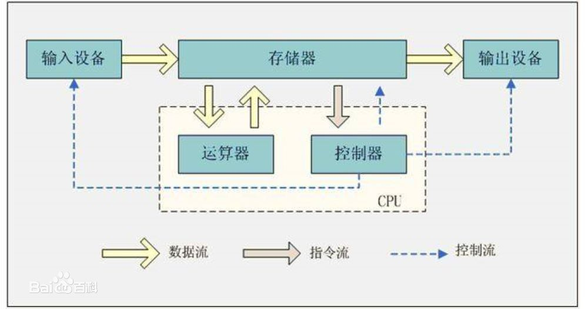

# 纳什合约网络白皮书 V0.1

**2019年9月1日**

**摘要:**

2013年底，比特币突破1000美元关口。这不仅证明了对等电子支付网络的现实可行性，更是在社会学意义上，人类第一次成功实现了对全世界所有人开放的大规模对等网络协作。从此之后，比特币的暴涨暴跌带来加密货币的热潮与投机疯狂，也激发了人们对于货币以外的应用场景的无穷想象。

以太坊通过智能合约将应用场景从单一的电子货币扩展到通用应用领域，创业者们开始试图用“去中心化场景”来重构和解决当今时代的生活、商业、社会甚至国家存在的各种问题，人们的想象力也扩展到了几乎无所不在的程度。

- [背景](#背景)
- [思路](#思路)
- [技术方案](#技术方案)
- [商业模式](#商业模式)

# 背景

2008年，中本聪（Satoshi Nakamoto）在[《比特币：一种对等网络电子现金系统》](https://bitcoin.org/bitcoin.pdf)中提出“区块链”概念。2009年，中本聪发布比特币网络客户端第一个版本，并开发出第一个区块，即[“创世区块”](https://www.blockchain.com/btc/block-height/0)。比特币的成功发布开创了一个全新的领域，。

维塔利克·布特林（Vitalik Buterin）撰写第一版[以太坊白皮书](https://blog.ethereum.org/2014/01/23/ethereum-now-going-public/),尝试通过智能合约将去中心化的应用场景从单一的电子货币扩展到通用应用领域。2014年，[以太坊通过ICO融资](https://github.com/ethereum/ethereum-org/blob/master/public/pdf/TermsAndConditionsOfTheEthereumGenesisSale.pdf)获取巨大成功，成为目前（至2019年9月1日）历史上最大金额的ICO项目。

实现这些“去中心化的场景”通常需要P2P网络技术、加密技术、时间戳技术和区块链技术等一系列技术手段。为了沟通方便，人们往往把这些技术集合简称为“区块链”。目前，“区块链”相关的技术进步、商业模型和社会意义还处在探索之中。除了少数大企业在谨慎的试探之外，区块链技术并没有真正介入企业市场和个人生活。

经过大量的行业调研和长时间的技术研究，我们认为：从技术层面讲，“区块链”能够真正落地并大规模应用的关键是最大范围共通且扎实可靠的信任根基。只有构建在这个信任根基之上的区块链服务才有可能承载类似现有互联网规模的应用场景，眼前行业聚焦的交易量、共识速度等具体指标重要但并不关键。

首先，目前所有区块链项目的根本缺陷都是假设上链数据的可信。但实际上区块链系统最大的不确定性来自人。人们为了利益在数据获取源头甚至计算执行过程中篡改数据是无法监督的。只有保证上链数据的可信性，才能从根本上解决区块链项目的可信性问题。

其次，在工程角度上，目前区块链技术的单一全局共识机制本身约束了系统所能承载的容量天花板。一方面，单一的统一共识算法决定了极少数出块节点成了容量的瓶颈。另一方面，现有的区块链项目依赖算法信任，这种全局信任的成本无法满足大量小成本标的的交易场景。

# 思路

那么这个最大范围的信任根基是否存在？它究竟是什么？

我们回过头来看比特币，比特币最神奇地方在于只依靠非对称加密、工作量证明、P2P网络以及链式块存储技术解决了点对点之间的信任传递问题。比特币并没有重新发明或者定义某种算法就建立了一个最小化的信任根基，那么在比特币之后涌现的一系列技术是否存在可能将这个信任根放大，大到足以承载整个互联网的可能？也就是说，我们能够在互连网层级的规模上解决去中心化的信任，同时必须适应业务场景的无限复杂性。

目前看来，任何单一的技术都无法达到这个目标。如果要达到这个目标，就需要一系列的技术集合。当代计算机都遵循冯·诺伊曼结构，将整个系统分为输入输出（IO）、计算（运算器与控制器）、存储三个部分。多数区块链技术通过点对点分布式存储、非对称加密以及链式块存储满足存储可信，但IO与计算都只限定了特定类型来解决可信问题。单纯的算法无法解决任意数据类型的IO以及计算也是多数区块链存在的问题。要实现最大范围的信任根，我们需要解决IO、计算以及存储的可信问题。同时，实体（人、组织、甚至AI等）作为最重要的IO源之一，同样需要纳入信任范围。

因此我们提出了信任空间的概念：信任空间被认为是网络空间的一个子集，网络空间当中的信息如果具有确定性，那么我们认为信息是在信任空间当中。信任空间的信息确定性我们定义如下：产生信息的主体(who)和环境（where）可以追溯到确定的信任根，产生信息的时间(when)确定，信息的内容(what)唯一。因此结合冯·诺伊曼结构之后，要实现信任空间至少需要满足以下四个条件：
1. 身份自主可信
2. 计算过程可信
3. 数据存储可信
4. 输入输出可信

身份自主可信是解决数字世界参与者的权利边界问题，计算过程可信是解决协作和交易过程的确定性预期，数据存储可信是解决数据的不可篡改，输入输出可信则是定义信任空间的边界。其中基于1与3可以确保用户对任何类型的数据声明其对数据拥有的权利，并可以将这种权利选择性的分享、出售或让渡给其它人。而2与4则确保用户在使用数据时不侵犯他人的权利。

作为身份自主可信的实现方案之一，分布式身份（Decentralized ID）目前已经作为草案提交了W3C（参见[这里](https://w3c-ccg.github.io/did-spec/)）同时基于DID也已经有了大量实现，例如　Indy、Sidetree等。狭义上的身份主要是指实体（人或机构）的身份，广义上的身份则应该包含设备与程序（包含一切产生、记录、计算数据的对象与过程）。身份自主可信需要满足以下条件：
1. 身份的自主性，用户自主选择信任根，并自主控制主密钥对的保存与使用；
2. 身份的确定和唯一性；
3. 身份的可匿名性，用户可以通过匿名与信任根的零知识证明保护自身隐私；

条件1确保用户的身份受自己而非第三方控制，条件2则保证每一个ID应当能够寻找到对应唯一的个体，条件3允许确保ID唯一的情况下最大限度的保护隐私，例如用户可以通过匿名ID访问数据，当特定服务要求用户具体属性时（例如年龄、国籍等）可以通过用户选择的信任根进行零知识证明；对于设备ID来说，厂家可以通过为设备分配多个ID或者特定算法生成ID的方式避免对设备唯一性的跟踪。

我们允许用户通过DID实名或者匿名的声明数据的所有权、商用权、二次加工权等一系列权利，同时将内容与权利声明加密存储在一个安全的存储系统中。安全存储需要满足以下两个条件：
1. 数据存储安全；
2. 数据对应的所有权安全；

条件1是对数据的基本保障，这个保障包含了数据的读取、写入、执行需要授权。用户自己的数据大多数情况下都可以安全的保存在可以自主控制的环境中，部分情况下出于分享（有偿或无偿）的考虑或者他人的要求保存在网络存储（非本地存储统称为网络存储）时，同样需要安全的存储。在网络存储环境中，文件的安全存储需要通过加密确保只有拥有密钥的用户可以读取对应内容。条件2是对所有权的基本保障，数据所有权可以由两方面体现：a. 谁拥有加密内容的密钥；b. 在公共账本上对数据（例如数值或特征哈希）与权利声明（所有权以及使用权智能合约）的唯一绑定。对于大多数私有数据，数据所有权可以通过a来体现，用户需要自己承担密钥的保存（本地加密保存）与分发（通过信任握手交换密钥）责任，同时对于使用密钥的程序要求密钥不能被窃取或者未授权保存；对于重要数据（例如对全网公开的数据、声明以及合约等）需要保存一份存证在公开的分布式账本当中，记录在分布式账本当中的存证应当保证全局唯一性，且不会被篡改。当全局存证声明的所有者与密钥实际持有人冲突时，应当遵循全局存证声明。如果只是权利声明而没有实质性的保护，那么和现有互联网对于权利保护只能走法律途径没有不同，无法把维权成本大幅降低。要做到实质性的保护，我们需要将硬件级的信任根植入到系统当中，实现计算过程可信。信任空间当中的可信执行环境应当满足以下条件：
1. 密钥计算以及智能合约相关的执行代码需要确保加载后未被篡改（符合全局存证或第三方公示信息的摘要值），确保执行代码的正确性；
2. 内存以及缓存数据需要通过隔离与加密的方式防止偷窥；
3. 能够确定执行硬件的身份（或者说能够确认不在调试或者模拟环境下执行）并能够进行远程验证（经由全局存证或第三方接口）

幸运的是，现代CPU普遍提供了可信执行环境，例如[Intel SGX](https://software.intel.com/en-us/sgx)、[AMD SEV](https://developer.amd.com/sev/)、[ARM Trustzone](https://developer.arm.com/ip-products/security-ip/trustzone)等，并提供了高度隔离的虚拟化容器，例如[Kata-containers](https://katacontainers.io)，可以让应用同时享受容器化的便利以及虚拟化的安全。在可信执行环境中，我们可以安全的存储和计算密钥钥，并执行内容、声明与合约。通过将操作系统的文件及网络接口逻辑处理放在可信环境中执行，可以让用户对于内容的使用限制在所有者声明范围之内，最大化的保护内容所有者的权益。而操作系统级的接口管理带来一个额外的好处，就是运行在操作系统上的应用几乎无需任何修改及适配就能运行在区块链的环境之中，也就是说，由应用创建的任何数据天生就是链上数据，通过可信DID身份以及可信软硬件环境，链上数据天生就具有可信属性。这也就意味着现有PC生产力环境输出的任何类型的数字内容，包括代码、程序、照片、CG、音乐、视频等，天生就在信任空间当中。这些多种类的数字内容在输入输出的环节同样应当确保在信任空间当中。信任空间的IO同样需要满足以下条件：
1. 输入输出对象的身份确定（是确定的“设备”而非“模拟”）且可以验证；
2. 传输过程不被泄漏或篡改；

网络传输环节的解决方案已经非常成熟（TLS/SSL等）。输入输出终端可信的解决方案目前并不多，例如数字版权管理(DRM，Digital rights management)等。但我们将这个视为产业升级的机会，能够通过IoT等更低成本的方式将内容保护真正普惠到每一个创作者。

信任空间中的多样化数字内容，在结合合适的智能合约形式之后，有可能激发新的生产力。现有的智能合约形式都是基于代码的形式，对于开发人员来说学习成本并不高，但是对于其它职业的创作者，如作者、记者、摄像师、导演、绘画师、音乐家、艺术家等如果要参与到合作当中来，重新学习智能合约的开发语言则会导致整个系统门槛太高。为了能让大多数人都能参与进来，智能合约需要以自然语言的形式表达，同时能够无歧义的翻译成多种语言。通过智能合约之间相互引用的特性，用户可以很容易的形成针对特定内容二次开发、代理销售等协作方式。数字内容的边际成本为零的特性，有可能让有限的利润进行几乎无限的分配，从而让生产过程中所有的人都能够从中获益。同时，信任空间提供的可追溯属性，让工作量按件、按量、按时等计费方式得以可靠实现，使实时动态的按劳分配有可能成为智能合约的重要属性之一。同时，信任空间提供的可追溯属性，让工作量按件、按量、按时等计费方式得以可靠实现，使实时动态的按劳分配有可能成为智能合约的重要属性之一。

# 技术方案

如何构建一个信任空间呢？

从之前的描述来看，一个信任空间的建立从严格意义上要将密码学应用到从底层硬件、操作系统、应用软件等一系列的环节当中。在这些重构当中，我们认为最核心的在于网络计算机之间交换信息前的验证协议，也被称之为“信任握手”。不同于TCP协议的三次握手，“信任握手”构建在协议层之上。在建立加密通讯通道之后，负责交换双方的软硬件环境信息以及用户信息，如下图所示。“信任握手”主要包含的内容有：1. 用户的可验证DID；2. 硬件加载软件时生成的度量信息、运行环境信息以及软件DID；3. 硬件的DID以及硬件对1与2信息的数字签名；4. 请求的具体内容。

其中1主要用于提供身份信息以及远程证明方式，对于某些特定类型的内容请求，响应方可以要求请求发起方提供更具体的身份信息证明，例如年龄、国籍等，避免信息传播到不适当的领域，同时请求方提供的远程证明方式也应当被响应方认可，如果响应方不认可请求方提供的远程证明方式，或者请求方提供的身份信息不符合要求，响应方可以拒绝服务；2主要是提供硬件认证过的程序加载信息，避免软件伪造自身版本，确保运行的代码正确性，响应方需要对请求方的软件版本进行验证（直接判断或者经过第三方）以决定对方的软件环境是否安全，是否符合自身的运行需求，如果不符合，则可以要求请求方通过符合要求的版本；3确定硬件的身份和对应的版本，并通过第三方对签名信息进行验证，确保签名内容是由指定版本的硬件产生，而非通过软件模拟；只有通过这三点的确认，才能迅速建立双方信任，确保请求内容交给对方之后，自身的利益不会受损。

负责发起握手、校验握手的程序，我们称之为“权利代理”，该程序实质上是代理行使他人权利，确保用户使用内容是在他人权利声明范围之内进行，同时也保护用户不受不符合自身要求的内容的侵扰。这个程序的形式是多样化的，可以是内核模块、独立程序甚至是浏览器插件，但无论它是以什么形式存在，都应当是用户访问这些内容的唯一入口，以及生成数据的唯一出口。权利代理应当完全遵守数据所有者通过智能合约表达的意愿，例如是否允许导出到信任空间之外（拷贝、复制粘贴、打印等），是否允许在数字内容上进行再创作等，是否允许保存在本地等等。

权利代理在运行时应当感知自身的软硬件运行环境，并对运行环境提出要求，例如硬件级别的加密支持、内存隔离、内存加密、安全运行验证等。也就是软硬件环境原理上来说能够提供的证明越多安全级别越高，同时验证渠道并不限于通过第三方网站验证、或者基于记录在公开的分布式账本上的公钥进行验证等。也许有人觉得这些运行环境和条件证明过于繁琐，在90年代初期互联网刚对公众开放时，用户为了交流信息同样需要购买安装调试对应的软硬件；信任空间交流的不只是信息，还有信任，而信任的传递同样依赖于软硬件的组合。

作为信任空间的基础设施之一，权利代理程序应当是自由开源且由社区共同开发的，并且允许任何人开发权利代理程序。对应的版本经由社区技术委员会讨论之后建立互信机制。对于权利代理程序的要求就是不能是闭源，且不应当阻止用户选择自己认为适合的权利代理程序。

围绕权利代理程序，信任空间的基础设施还应当包含如下：
* 合约语言（灵犀/Telepathy）

Telepathy 作为一种类自然语言的编程语言，可以视为信任空间内一种法律的DSL（Domain-Specific Language），无需实现图灵完备，同时可以自动执行。Telepathy 的组成要素与一般合同并无二致，包括引用、定义、条款三要素。引用包含两种，一种是合约引用，一种是条款引用；合约引用将会直接链接到其它合约，并执行其中的指定条款；而条款引用则是引用合约内部条款，通过条款的共同作用达到目的。定义一般是指定签约方以及合约的操作对象，签约方可以指定（双方或者多方合约）也可以不指定（使用声明）；操作对象包含加密货币、文件、文件内容甚至计数、统计等任何可以通过扩展手段采集的结构化数据。条款则是定义条件判断以及执行内容。Telepathy 应当有专用的编辑器以及运行环境；专用编辑器不但方便用户编写，同时方便用户对合约条款进行演算，判断己方利益以及检查条款冲突；而运行环境则会安全执行合约，同时将所有操作打包为一个交易，只有交易整体成功提交才能最终执行。Telepathy运行在权利代理或者联盟存证链当中，通过功能插件与支付插件的接口对外操作，合约一旦生成，外部除了触发合约执行和展示合约内容以外不能改变合约运行内容或条件；功能插件主要是执行采集、计数、统计等功能的外部实现，通常建议以动态链接库的方式与合约集成，功能对于插件的入参与出参类型有严格的限制，同时应当对于任何类型的参数输入都能正常处理，不能轻易终止处理或者崩溃；对于支付插件来说，主要用于对接各种支持点对点支付的电子货币，并负责各类电子货币之间的实时兑换，确保用户购买时支付的资金能够正确的转入到卖方账户中。

* 分布式文件系统（Decentralized Filesystem）

DFS主要承担内容保存及分发的功能，DFS分布在整个平台所有参与者之中，DFS之中分为两种角色，一种是用户节点，用户可以在本地保存自己的内容，以及自己经常访问或希望收藏的内容；另一种是备份/分发节点，负责数字内容的备份与分发；默认情况下若干备份/分发节点组建一个集群，而整个平台当中有若干集群存在，每一个集群都由一个运营方维护，每个用户可以选择至少一个运营方作为自己的备份/分发节点；而备份/分发节点通过为用户内容的服务，根据容量或者流量从用户的内容收入当中收取一定的费用。DFS存储的内容主要包括：用户私有数据、用户公开数据、应用程序日志、公开应用程序镜像库、私有应用程序镜像库、存证数据、合约交易等。运营方可以选择拒绝为某位或者某类用户服务，但是不能在服务期间删除或者丢失用户数据。

* 联盟存证链（Consortium Blockchain of Evidence）

CBE主要承担身份、声明、合约与交易的存证以及查询；CBE当中具有写入权限的成员是由社区投票选举出来进行记账，同时也是平台规则的讨论与制定者，代表社区成员发表意见；联盟的最终决议将以全局合约的形式存储在平台当中；考虑到联盟链负载较高，联盟链的共识算法将会采用允许高并发的共识算法，例如PBFT或改进型BFT进行全局共识；共识记账接受全局监督，记账结果记录在DFS当中以便随时查阅。

当具备这四个条件之后，人们在可能会通过三种方式使用信任空间：
1. 浏览器

使用信任空间中的内容最直接简单的方式就是通过浏览器，信任空间中的浏览器不但能够安全的保护用户的密钥，也能够通过信任握手安全交换内容密钥，并遵照内容所有者的声明提供给用户合理的使用权限——是否能够复制、修改、导出等等。用户不但能够从浏览器中管理自己的内容和合约，同时也能浏览其他人的内容，使用其他人提供的Webapp等。不过浏览器对于内容呈现、应用性能等方面的限制较大，需要通过其它的方式提供更好的用户体验。
2. 容器化应用

独立的应用程序通常能够更加充分的发挥硬件带来的优势，从而提供更好的用户体验。但传统的独立应用受限于操作系统，对于自身安全和用户数据的保护并不足够。在不考虑等待操作系统自身完善这方面的前提下，我们可以通过将应用程序封装到容器当中的方式将应用程序与操作系统解耦，并为应用程序提供更好的安全隔离。通过容器内的系统应用为应用程序提供实现可信计算环境，另一方面，为了维持环境安全，我们认为在容器中运行的应用程序应当通过开源的方式保证自身不会作恶。容器化应用可以基于现有操作系统为用户提供更好的用户体验，但从根本上来说用户的操作与管理不是在一个统一的平台上完成的，内容在多个应用之间传递的时候会造成很多的麻烦，因此需要通过其它方式提供更好的用户体验。
3. 操作系统

我们认为一个完整的信任空间解决方案应该是基于完全的可信硬件以及完全的可信软件，作为可信软件当中的基础——操作系统能够为上层的应用软件提供安全和便利两方面的保障。但无论从项目规模还是技术复杂度来看，这都会是一个远期目标。需要强调的是，这个操作系统并非以太坊的“互联网计算机”或者EOS的“企业操作系统”，这些所谓的计算机与操作系统只是逻辑上的计算机与操作系统，而信任空间操作系统则是现有操作系统的升级版本，包括内核、驱动、框架、网络等模块都从可信角度重新实现，最大限度的为用户提供安全的执行和存储环境。

# 商业模式

现代互联网行业的发达基于两个原因：一是开源，从编程语言、开发软件到操作系统，开源软件能够为互联网公司快速构建产品，同时因为开源标准的相对统一化导致人员技能的通用化，互联网公司能够为自己的新项目通过高薪方式快速招募到合适的人才，整个行业才能以从未有过的速度发展壮大；另一个是“羊毛出在狗身上”的商业模式，一方面通过免费的服务吸引大量用户的注意力，另一方面将这些注意力出售给愿意付费的厂商。但是这两个因素背后的隐忧已经开始逐渐显现，例如，开源软件的商业模式通常是提供免费的社区版本，通过专业版、定制功能或者咨询服务等方式获取收入（完全由大公司资金支持无需考虑收入的项目不在讨论范围内）。而时下越来越流行的云服务提供商正在将越来越多的流行开源软件整合到自己的服务当中，此时开源软件厂商的商业模式会被打破——互联网公司在使用云服务软件时产生的问题通常会直接求助云服务厂商而非软件开发商；同时云服务厂商通常会在此类软件服务当中提供很多定制化的服务，造成相同软件不同厂商之间的版本差异，结果会让互联网公司的迁移成本大大提高，最终形成新的商业壁垒。从商业逻辑上来说，最大化自身利益并没有问题，问题在于这样做其实等于在开历史的倒车，让开放重新变为封闭。

对于最终用户来说同样也是不可接受的趋势：互联网巨头将存储在自己服务器上的用户数据视为己物，通过他们引以为傲的大数据与人工智能对数据进行加工处理来获取最大化的利益。同时即使在网络上付费购买的内容，也不属于用户，最典型的案例就是音乐。通常大型互联网音乐公司都会大量购买独占性的音乐版权从而获取用户，而最终用户在不同的音乐APP中购买的音乐却不能出现在同一个播放列表中。更不用提哪些已经发生或者潜在的大规模隐私泄漏事件。这似乎是一个无法逃逸的陷阱，当我们享受便利的同时，我们在付出更大的代价。而当我们希望拒绝付出这些代价时，发现要么不使用这些网络服务，要么只能祈祷这些互联网公司的每一个员工及前员工都在遵守道德约束、克制自己获取更多财富的冲动、以及系统安全完全无懈可击。那么有没有可能既享受现代网络的便利，同时又拥有完全自我控制的能力？

要做到这一点，需要满足两个条件：a. 最终用户掌握自己的数据，并且可以选择通过分享或者出售的方式授权给其它用户/公司/机构访问；b. 符合黑客道德，同时满足利益最大化的需求。条件a要求用户的计算过程与计算结果在用户可以掌控的方式下进行，并且由用户管理对应的密钥，要满足这两点并不难，利用类似IPFS或者区块链之类的技术也能够实现；但如果要将内容授权给他人，并限制他人的使用，实际落地就会比较困难；例如个人身份数据、健康数据等信息（隐私数据）就不希望内容被修改、被再次分享或出售；而源代码、文档等内容（公开数据）则应当鼓励分享与修改。实际上条件b更难实现，商业逻辑是建立在稀缺性基础之上，而黑客道德是建立在利用数据信息复制成本几乎为0的基础上稀释稀缺性，从而使得信息能够得到最广泛的传播、产生最大的增量，稀缺性与信息属性的脱钩使得黑客道德在商业逻辑前会变得很脆弱。

我们仔细剖析一下商业逻辑，传统以版权为代表的商业逻辑实际上是捆绑了所有权（是谁的）与使用权（谁能用）来制造稀缺性；互联网免费商业模式，也就是“羊毛出在狗身上”，建立在互联网公司对用户数据充分开发的基础上，因此互联网商业模式同样是建立在所有权不清晰的稀缺性用户数据之上。也就是说要避免原有商业模式的缺陷必须做到所有权清晰，并且所有权与使用权分离。流行的开源代码版本管理库（例如Github）将所有权与使用权分离，允许用户不影响原有作者所有权的情况下fork之后进行充分的修改后发布；那么假设我们在发布时将项目的贡献比例（或者某种分成比例）写入智能合约，在用户通过软件进行付费（包含支付费用给开发者或者支付给内容所有者）时触发智能合约，将用户支付的费用按照智能合约当中的比例存入贡献者的账户当中，那么就可以实现软件整个生命周期（包括源代码）的所有权与使用权分离，允许软件在最大化开放自由的同时实现贡献者的利益最大化（无论你是原始作者，还是fork后修改的作者，或者数字内容创作者）。

如果任何人都可以获取源代码并进行修改，软件收费的逻辑似乎也走不通，而且软件或者数字内容很可能不再具备稀缺性。我们认为这个体系的实现需要如下几个要素：

a. 用户使用代码、程序或者任何数字内容支付的对象可以是法币、数字货币或加密货币，但我们更鼓励通过支付某种未来收益权的方式来购买生产资料。未来收益权可以记录在智能合约中，并在适合的时候由智能合约执行。通过延迟交易的方式充分鼓励用户进行各种各样的创作，并建立合适的利益输送渠道，让更多的人同时受益。

b. 充分自由竞争条件下的合约可继承性。在任何人都能修改、发布代码与软件的情况下，合约的可继承性时关系到利益输送渠道是否有效的必要条件之一。任何人基于其他人提供的代码、程序或者数字内容进行生产时，都需要继承原有的智能合约；任何人在对外提供代码、程序或者数字内容时，也需要提供对应的智能合约，定义其他人使用与购买的相关条款，但不应完全覆盖原来的条款。健全的可继承合约链更能反向鼓励用户提供更好的代码、费用更合理的程序与数字内容。

c. 在新的商业模式下，稀缺性来自于个性化。当所有人都能够提供数字生产资料时，原有的稀缺性将不复存在，依靠统一化的大规模生产、统一化的定价与销售也很难满足所有人的需求。个性化的需求并不只是个性化的软件界面或功能，更包括个性化的内容、个人在各类数字内容消费数据产生的AI模型等，数据将不再以公司为维度进行聚集，而是以个人为维度进行聚集。

d. 通过技术的方式保证他人权利不被侵犯。当智能合约从另外一个角度构建了全新的商业模式，我们认为不能仅仅依靠个人道德或者可能滞后的法律条款来保证这一切的执行，人们为了利益可能试图去除数字内容与智能合约的绑定、获取数据密钥、数字内容甚至他人私钥等。我们并不是限制人们使用、修改和传播软件的自由，我们希望限制的是“可能伤害其他人的自由”：不遵循所有者提供的使用意愿、破坏创作者的集体利益、窃取用户隐私与数据等。因此我们认为这个模式运行的基础应该是由软件和硬件共同提供的一个安全框架，也就是信任空间。

基于信任空间的商业模式可以用一个简单的示例加以解释，例如A开发了一个聊天软件，B基于A的软件添加了一个购物功能，C使用B的软件销售了一批商品，那么在这个交易链条当中，用户在给C支付线上交易费用时，智能合约就能根据未来收益权将C利润按贡献比例分配给B和A，也就是说B对A的修改不会影响A本身的利益；若此时D基于A的版本提供了更好的版本，C改用了D的版本，那么D的利润将会分配给D和A。在这个简单的例子当中我们很容易得到一些推论：由于软件自身的边际成本为0的特性，我们可以构建足够长的交易链条容纳更多人的利益；同时由于天生开放自由竞争的关系，软件始终会趋于更贴近用户需求、成本更合理的方向发展，而不会被人为意志所阻碍；对于用户来说，能够在更透明安全可靠的环境下运行软件，同时保留了将维度更完整的自有数据进行脱敏之后有选择的出售或者贡献给相关机构的可能性，对比原有互联网将会更具吸引力。虽然目前就具体的分配模式、消费与生产的界定方面还有具体可以讨论的空间，但我们认为基于信任空间所创造的经济模式，包括基于贡献分配的合约链（不光是编码和创作，还可以包括销售和推广等）和以个人为维度的数据聚合（任何人创造的任何数据对于AI来说都是有价值的），有可能能代表绝大多数人的利益。
